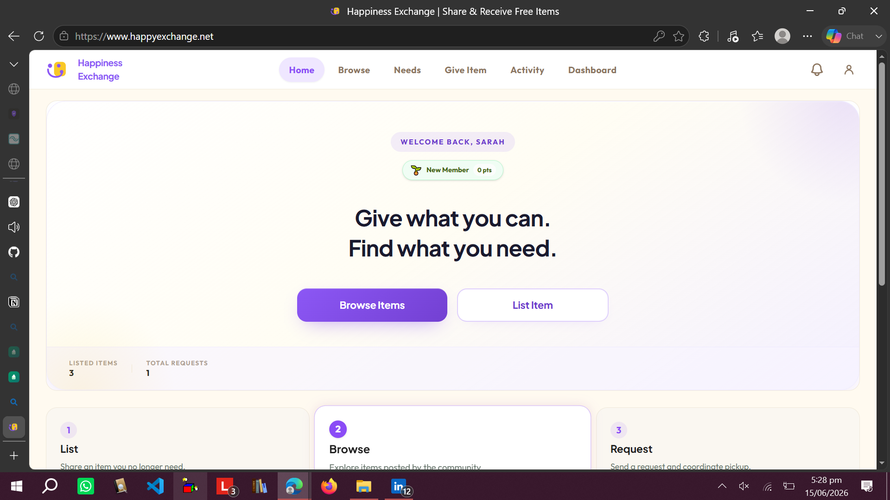
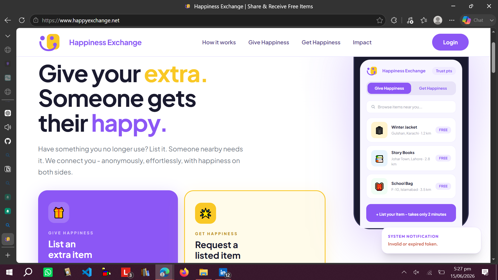
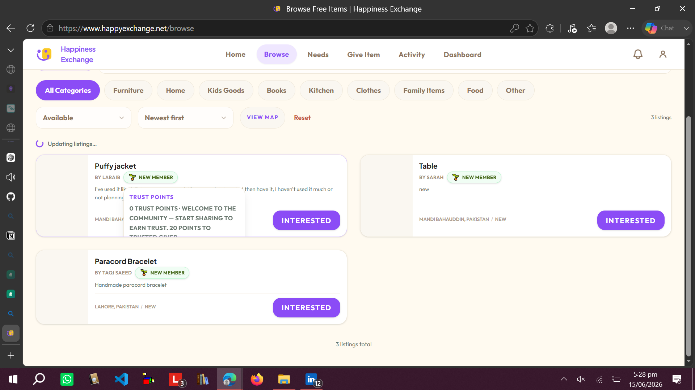

# Happiness Exchange

A full-stack community platform designed to connect donors with individuals in need through structured requests, approvals, and management workflows.

**Live:** https://happyexchange.net

---

## 📌 Overview

Happiness Exchange is a web-based platform that enables users to create, manage, and respond to help requests in a structured and transparent system.
It includes authentication, role-based access, and an admin-controlled workflow system.

The goal is to make community support more organized, trackable, and efficient.

---

## 🚀 Features

* User authentication and secure login system
* Request creation and management system
* Approval and rejection workflow for requests
* Admin dashboard for platform control
* Role-based access control
* Responsive user interface
* Real-time status updates for requests

Local email testing (Mailpit, dummy users, optional verification bypass): see [docs/LOCAL_EMAIL.md](docs/LOCAL_EMAIL.md).

---

## 🛠️ Tech Stack

### Frontend

* React
* JavaScript
* UI components

### Backend

* FastAPI
* Python
* REST APIs

### Database

* MongoDB

### Deployment

* Cloud deployment (Vercel / backend hosting)

---

## 📸 Screenshots

### 🏠 Landing Page



### 📊 Dashboard



### 📄 Request Management



---

## ⚙️ Getting Started

### Frontend Setup

```bash id="hx_frontend"
cd Frontend
npm install
npm run dev
```

### Backend Setup

```bash id="hx_backend"
cd Backend
pip install -r requirements.txt
uvicorn app:app --reload
```

---

## 📌 Purpose

This project demonstrates full-stack development skills, including authentication systems, workflow design, API integration, and production deployment practices.
